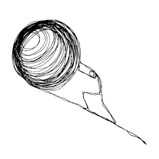

<h2 align="center">Hi 👋! My name is Fathy and I'm a full-stack developer, from Egypt.</h2>

###
- 📚 Currently learning the fundamentals of computer science by following the [Teach Yourself CS](https://teachyourselfcs.com) books and courses recommendations.
- 📚 Currently following [The Odin Project](https://theodinproject.com) curriculum for my full-stack path.

 

###

### Languages and Tools:

  
  
  
  
  
  
  
  
  
  
  
  
  
  
   

###

### Conatct with me:

  
  
  

###

 

  
  

###

 

<!--  -->

###
